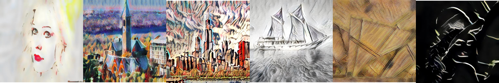

# pytorch-AdaIN

Unofficial PyTorch implementation of:

- X. Huang and S. Belongie, *Arbitrary Style Transfer in Real-time with Adaptive Instance Normalization* (ICCV 2017)

Original Torch implementation:
https://github.com/xunhuang1995/AdaIN-style



Korean guide: `README.ko.md`

## 1) Environment Setup

```bash
python3 -m venv .venv
source .venv/bin/activate
pip install -r requirements.txt
```

Recommended Python: **3.10 ~ 3.12**.

## 2) Project Layout

```text
.
├── input/                      # content/style sample datasets
├── models/                     # pretrained weights (decoder.pth, vgg_normalised.pth)
├── output/                     # generated images (ignored by git)
├── report_assets/              # report generation scripts + generated assets
├── docs/
│   ├── papers/                 # source papers
│   └── reports/                # generated report docs
├── test.py                     # image stylization
├── test_video.py               # video stylization
├── train.py                    # baseline training
├── train_improved.py           # improved/generalization training
├── train_generalize.sh         # recommended improved training preset
├── run.sh                      # RGB-safe inference wrapper (single/multi-style)
└── run_best.sh                 # RGB-safe inference wrapper for best decoder
```

## 3) Prepare Models

Put model files under `models/`:

- `models/decoder.pth`
- `models/vgg_normalised.pth`

You can download baseline checkpoints from the original release:
https://github.com/naoto0804/pytorch-AdaIN/releases/tag/v0.0.0

## 4) Inference

### Single content + single style

```bash
python test.py \
  --content input/content/cornell.jpg \
  --style input/style/woman_with_hat_matisse.jpg \
  --output output
```

### Batch: all content x all style combinations

```bash
python test.py \
  --content_dir input/content/PNG \
  --style_dir input/style/test \
  --output output
```

### Blend multiple style images as one style

```bash
python test.py \
  --content_dir input/content/PNG \
  --style input/style/a.jpg,input/style/b.jpg,input/style/c.jpg \
  --style_interpolation_weights 1,1,1 \
  --content_size 64 --style_size 64 --crop \
  --output output
```

Note: in style interpolation mode, style tensors must share the same spatial size. Using `--content_size`, `--style_size`, and `--crop` is the safe option.

### Recommended wrapper (handles RGBA PNG -> RGB conversion)

```bash
./run_best.sh \
  --decoder experiments_improved/<run_name>/best_decoder.pth.tar \
  --content_dir input/content/PNG \
  --style_dir input/style/test \
  --output output/new_run
```

## 5) Training

### Baseline

```bash
python train.py --content_dir <content_dir> --style_dir <style_dir>
```

### Improved generalization training preset

```bash
./train_generalize.sh
```

Main logs/checkpoints are written to:

- `logs_improved/`
- `experiments_improved/`

## 6) Report

Generate report assets:

```bash
python report_assets/data/generate_report_assets.py
python report_assets/data/generate_generalization_report.py
```

Report documents are in:

- `docs/reports/research_paper_adain_improvement.md`
- `docs/reports/research_paper_adain_improvement.html`
- `docs/reports/research_paper_adain_improvement.pdf`

## References

- [1] X. Huang and S. Belongie. *Arbitrary Style Transfer in Real-time with Adaptive Instance Normalization*, ICCV 2017.
- [2] https://github.com/xunhuang1995/AdaIN-style
